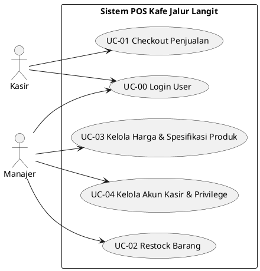

# Dokumentasi Use Case & Entity Relationship Diagram (ERD)
## Sistem POS Kafe Jalur Langit (7 Tabel & 3 Trigger)

Dokumen ini berisi spesifikasi Use Case dan perancangan Entity Relationship Diagram (ERD) untuk Sistem Point of Sale (POS) Kafe Jalur Langit.

---

## 1. Diagram & Spesifikasi Use Case

Sistem POS Kafe Jalur Langit memiliki 5 Use Case utama dengan dukungan **User Access Control** (Autentikasi & Hak Akses Peran Manajer vs Kasir).

### Kode PlantUML Diagram Use Case



---

### Rincian Spesifikasi Use Case

#### UC-00 — Login User
- **Aktor**: Kasir, Manajer
- **Deskripsi**: Otentikasi identitas pengguna dan penerbitan token JWT.
- **Pre-condition**: Pengguna memiliki akun aktif pada tabel `pengguna`.
- **Post-condition**: Token JWT diterbitkan, hak akses role `manajer_role` / `kasir_role` aktif.
- **Stored Procedure**: `sp_login(username, password)`
- **Endpoint API**: `POST /api/v1/auth/login`

#### UC-01 — Checkout Penjualan
- **Aktor**: Kasir
- **Deskripsi**: Pemrosesan transaksi pesanan menu kafe, pemotongan stok porsi otomatis via trigger, dan penerbitan struk digital JSONB.
- **Pre-condition**: Kasir telah login (`peran = 'kasir'`), menu kafe tersedia di katalog (`stok > 0`).
- **Post-condition**: Transaksi tersimpan, stok porsi berkurang, dokumen struk JSONB diterbitkan.
- **Stored Procedure**: `sp_checkout_transaksi(id_kasir, items_jsonb)`
- **Trigger Terkait**: `trg_kurang_stok` (AFTER INSERT ON `detail_transaksi`)
- **Endpoint API**: `POST /api/v1/transaksi/checkout`

#### UC-02 — Restock Barang
- **Aktor**: Manajer
- **Deskripsi**: Pencatatan penambahan stok porsi menu kafe dari supplier.
- **Pre-condition**: Manajer telah login (`peran = 'manajer'`), menu terdaftar di katalog.
- **Post-condition**: Stok porsi menu bertambah otomatis via trigger, riwayat restock tersimpan pada `restock`.
- **Stored Procedure**: `sp_restock_barang(id_manajer, id_barang, jumlah_tambah, nama_supplier)`
- **Trigger Terkait**: `trg_tambah_stok_restock` (AFTER INSERT ON `restock`)
- **Endpoint API**: `POST /api/v1/restock`

#### UC-03 — Kelola Harga & Spesifikasi Produk
- **Aktor**: Manajer
- **Deskripsi**: Pembaruan harga jual menu dan spesifikasi varian dinamis berformat JSONB.
- **Pre-condition**: Manajer telah login (`peran = 'manajer'`).
- **Post-condition**: Harga atau spesifikasi JSONB menu diperbarui. Validasi terproteksi trigger.
- **Stored Procedure**: `sp_update_harga_spesifikasi(id_manajer, id_barang, harga_baru, spek_baru)`
- **Trigger Terkait**: `trg_validasi_harga_barang` (BEFORE INSERT OR UPDATE ON `barang`)
- **Endpoint API**: `PUT /api/v1/barang/:id`

#### UC-04 — Kelola Akun Kasir & Privilege
- **Aktor**: Manajer
- **Deskripsi**: Pengelolaan akun pengguna kasir (pembuatan akun baru, pengaturan hak akses privilege, penonaktifan akun, serta daftar pengguna).
- **Pre-condition**: Manajer telah login (`peran = 'manajer'`).
- **Post-condition**: Akun kasir berhasil dibuat/dikonfigurasi/dinonaktifkan pada tabel `pengguna`.
- **Stored Procedure**: `sp_get_daftar_pengguna`, `sp_buat_akun_kasir`, `sp_atur_privilege`, `sp_nonaktifkan_akun`
- **Endpoint API**: `GET /api/v1/akun`, `POST /api/v1/akun/kasir`, `PUT /api/v1/akun/privilege`, `DELETE /api/v1/akun/:id`

---

## 2. 3 Trigger Otomatis Basis Data

1. **`trg_kurang_stok`** (`AFTER INSERT ON detail_transaksi`):
   - Memotong stok porsi di `barang` saat transaksi checkout terjadi. Jika stok kurang dari 0 (`stok < 0`), trigger membatalkan (`RAISE EXCEPTION`) dan melakukan rollback otomatis.
2. **`trg_tambah_stok_restock`** (`AFTER INSERT ON restock`):
   - Menambahkan stok porsi di `barang` secara otomatis saat manajer mencatat jurnal restock dari supplier.
3. **`trg_validasi_harga_barang`** (`BEFORE INSERT OR UPDATE ON barang`):
   - Memproteksi integritas data di level database untuk memastikan `harga > 0` dan `stok >= 0`.

---

## 3. Entity Relationship Diagram (ERD)

Basis data POS Kafe Jalur Langit terdiri dari **7 tabel** yang terintegrasi secara proporsional.

### Diagram Visual Mermaid ERD

```mermaid
erDiagram
    pengguna ||--o{ transaksi : "memproses (id_kasir)"
    pengguna ||--o{ restock : "melakukan (id_manajer)"
    kategori ||--o{ barang : "mengelompokkan (id_kategori)"
    barang ||--o{ detail_transaksi : "dipesan (id_barang)"
    barang ||--o{ restock : "direstock (id_barang)"
    transaksi ||--|{ detail_transaksi : "memiliki (id_transaksi)"
    transaksi ||--|| struk : "menerbitkan (id_transaksi)"

    pengguna {
        int id_pengguna PK
        string username UK
        string password_hash
        string nama_lengkap
        string peran
        boolean is_active
    }

    kategori {
        int id_kategori PK
        string nama_kategori UK
    }

    barang {
        int id_barang PK
        string nama_barang
        int id_kategori FK
        decimal harga
        int stok
        jsonb spesifikasi
        boolean is_active
    }

    transaksi {
        int id_transaksi PK
        int id_kasir FK
        decimal total_bayar
        timestamp created_at
    }

    detail_transaksi {
        int id_detail PK
        int id_transaksi FK
        int id_barang FK
        string nama_barang
        decimal harga_satuan
        int jumlah
        decimal subtotal
    }

    struk {
        int id_struk PK
        int id_transaksi FK_UK
        jsonb data_struk
        timestamp dicetak_at
    }

    restock {
        int id_restock PK
        int id_barang FK
        int jumlah_tambah
        int id_manajer FK
        string nama_supplier
        timestamp created_at
    }
```

---

### Kode DBML (Dapat Dipaste ke dbdiagram.io)

```dbml
Table pengguna {
  id_pengguna integer [pk, increment]
  username varchar(50) [unique, not null]
  password_hash varchar(255) [not null]
  nama_lengkap varchar(100) [not null]
  peran varchar(20) [not null]
  is_active boolean [not null, default: true]
}

Table kategori {
  id_kategori integer [pk, increment]
  nama_kategori varchar(50) [unique, not null]
}

Table barang {
  id_barang integer [pk, increment]
  nama_barang varchar(100) [not null]
  id_kategori integer [not null, ref: > kategori.id_kategori]
  harga numeric(12,2) [not null]
  stok integer [not null, default: 0]
  spesifikasi jsonb
  is_active boolean [not null, default: true]
}

Table transaksi {
  id_transaksi integer [pk, increment]
  id_kasir integer [not null, ref: > pengguna.id_pengguna]
  total_bayar numeric(14,2) [not null]
  created_at timestamptz [not null, default: `now()`]
}

Table detail_transaksi {
  id_detail integer [pk, increment]
  id_transaksi integer [not null, ref: > transaksi.id_transaksi]
  id_barang integer [not null, ref: > barang.id_barang]
  nama_barang varchar(100) [not null]
  harga_satuan numeric(12,2) [not null]
  jumlah integer [not null]
  subtotal numeric(14,2) [not null]
}

Table struk {
  id_struk integer [pk, increment]
  id_transaksi integer [unique, not null, ref: - transaksi.id_transaksi]
  data_struk jsonb [not null]
  dicetak_at timestamptz [not null, default: `now()`]
}

Table restock {
  id_restock integer [pk, increment]
  id_barang integer [not null, ref: > barang.id_barang]
  jumlah_tambah integer [not null]
  id_manajer integer [not null, ref: > pengguna.id_pengguna]
  nama_supplier varchar(100)
  created_at timestamptz [not null, default: `now()`]
}
```
